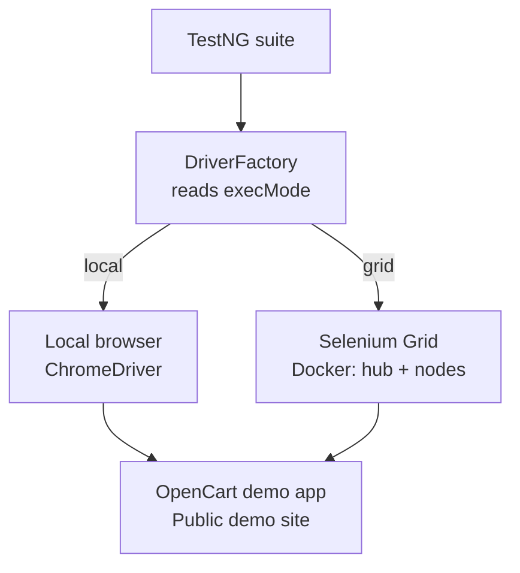
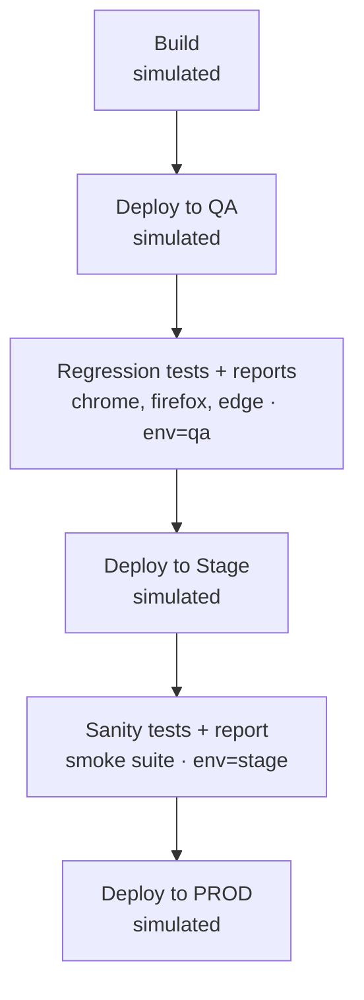

<div align="center">

# Selenium Test Automation Framework


A Java + Selenium framework built around the Page Object Model, testing the [OpenCart demo application](https://naveenautomationlabs.com/opencart/) end to end — login, account, search, product info, and registration — with the plumbing to run it anywhere: your IDE, a Selenium Grid, or a Jenkins pipeline.

</div>

---

## Why this exists

This is a portfolio project demonstrating a complete automation pipeline, not just a pile of test scripts: **local execution → cross-browser regression → Selenium Grid → full Maven lifecycle → CI/CD via Jenkins.** The goal was to build something close to what a real QA automation setup looks like inside an organization — same test code, different execution environments, driven entirely by config.

## Contents
- [Architecture](#architecture)
- [Running the tests](#running-the-tests)
- [Project structure](#project-structure)
- [Tech stack](#tech-stack)

---

## Architecture

### Design pattern
**Page Object Model (POM).** Each page of the application under test has a corresponding class in `src/main/java/com/qa/opencart/pages/`, exposing methods for the actions and assertions relevant to that page. Test classes in `src/test/java/com/qa/opencart/tests/` consume these page objects rather than touching Selenium locators directly — the tests read like user actions, not implementation detail.

### Core components

| Component | Location | Responsibility |
|---|---|---|
| `DriverFactory` | `factory/` | Initializes the WebDriver based on config (`browser`, `remote`), loads environment properties, exposes screenshot capture |
| `OptionsManager` | `factory/` | Builds browser-specific `Options` objects (headless, incognito, capabilities) |
| `BaseTest` | `test/base/` | TestNG lifecycle hooks — driver setup/teardown, screenshot-on-failure |
| Page classes | `pages/` | One class per application page (Login, Accounts, Search, ProductInfo, Register) |
| `ElementUtil` | `utils/` | Wrapper around Selenium waits and element interactions |
| `ExcelUtil` / `CSVUtil` | `utils/` | Data-driven testing — reads test data from `.xlsx` / `.csv` |
| `TestAllureListener`, `AnnotationTransformer`, `Retry` | `listeners/` | TestNG listeners for Allure step logging, annotation-level config, and retry-on-failure |
| `AppConstants` | `constants/` | Centralized constants (expected titles, URLs, timeouts) |

### Configuration
Environment-specific settings live in `src/test/resources/config/` (`config.properties`, `qa.`, `dev.`, `stage.`, `uat.`), selected at runtime via the `-Denv` system property. Each file controls:

- `browser` — which browser to launch
- `remote` — `true` to run against a Selenium Grid hub, `false` for local
- `huburl` — Grid hub endpoint (used only when `remote=true`)
- `headless`, `incognito`, `highlight` — browser behavior flags
- application `url`, and test-account `username` / `password`

**How execution routing works:**

The same test code and suite XML run **unchanged** in both paths — only the `execMode` / `remote` config value, and correspondingly which `WebDriver` implementation `DriverFactory` instantiates, differ.

### Reporting
- **Allure** — step-level reporting via `@Epic` / `@Feature` / `@Story` / `@Step` annotations on test classes, published as an HTML report.
- **ChainTest** — an alternate HTML report with screenshot embedding on failure, published separately in the Jenkins pipeline.

### Cross-browser & parallel execution
TestNG suite XML files in `src/test/resources/testrunners/` define what runs and how:

| Suite | Coverage | Notes |
|---|---|---|
| `testng_sanity.xml` | Single browser | Minimal smoke coverage |
| `testng_regression.xml` | Chrome, Firefox, Edge | `parallel="tests"`, `thread-count="2"` |
| `testng_chrome.xml` | Chrome only | Full suite |

### Selenium Grid
`docker-compose.yml` spins up a Selenium Grid (hub + Chrome/Firefox/Edge nodes, version `4.47.0`) for running the suite against a containerized grid instead of local browser binaries — controlled entirely via the `remote` / `huburl` config values above, **no test code changes required.**

### Maven build lifecycle
The project exercises the full Maven lifecycle, not just test execution:

| Phase | What happens |
|---|---|
| **Compile** | `maven-compiler-plugin` compiles against Java 17 |
| **Test** | `maven-surefire-plugin` runs the suite (`forkCount=3`, `reuseForks=true`, AspectJ weaver attached for Allure) |
| **Package** | Produces two artifacts: the standard jar, and a **fat jar** (`*-jar-with-dependencies.jar`) via `maven-assembly-plugin`, bundling all dependencies into one deployable/runnable jar |
| **Deploy** | `maven-deploy-plugin` publishes both the POM and the fat jar to a self-hosted **Nexus 3** snapshot repository (`nexus-snapshots`) |

```bash
mvn clean deploy -DskipTests=true
```

> **Credential handling:** the Nexus repository URL in `pom.xml` contains no embedded credentials. Authentication is resolved by Maven at deploy time via a matching `<server>` entry (by `id`) in the local `~/.m2/settings.xml`, which is never committed to the repository — keeping the Nexus username/password out of version control entirely.

> **Current state:** the deploy step above is a capability exercised manually from a local machine — it's not yet wired into the Jenkins pipeline as an automated stage. Package/Deploy stages could be added to the `Jenkinsfile` using Jenkins' Credentials/Config File Provider plugin to inject `settings.xml` at build time.

### CI/CD — Jenkins


The `Jenkinsfile` defines a pipeline with these stages:

1. **Build** *(simulated)* — placeholder for where an application build/package step would run in a real org's pipeline. Since this project targets a public demo application rather than a self-hosted one, there's nothing of ours to build here — the stage exists to show where it belongs in the flow.
2. **Deploy to QA** *(simulated)* — placeholder representing the application under test being deployed to a QA environment.
3. **Regression Automation Tests** — checks out this repo and runs the full cross-browser suite (`testng_regression.xml`, `-Denv=qa`). A test failure marks the build unstable rather than failing it outright, so reports still publish.
4. **Publish Allure Reports** — publishes the Allure results from the regression run.
5. **Publish ChainTest Report** — publishes the ChainTest HTML report from the regression run.
6. **Deploy to Stage** *(simulated)* — placeholder representing deployment to a staging environment.
7. **Sanity Automation Tests** — runs the smoke suite (`testng_sanity.xml`, `-Denv=stage`), same unstable-on-failure handling.
8. **Publish sanity ChainTest Report** — publishes the ChainTest HTML report from the sanity run.
9. **Deploy to PROD** *(simulated)* — placeholder representing promotion to production once both suites have passed.

*Stages marked (simulated) are `echo`-only placeholders — intentionally left unimplemented rather than removed, to show where they'd sit in a real CI/CD flow around a genuine build/deploy pipeline. This project's actual scope is the test automation and its execution stages, not building or deploying the application under test.*

---

## Running the tests

### 🖥️ Locally, from an IDE
Run any test class directly (e.g. right-click `LoginPageTest` → Run). The browser defaults to `chrome` if no suite XML is involved.

### ⚙️ Locally, via Maven + a TestNG suite
```bash
mvn clean test -Dsurefire.suiteXmlFiles=src/test/resources/testrunners/testng_regression.xml -Denv=qa
```

### 🐳 Against Selenium Grid
1. Start the Grid:
   ```bash
   docker compose up -d
   ```
2. Set `remote=true` in the relevant `config.properties` (or the environment-specific file matching `-Denv`).
3. Run as above — the same suite XML and test code execute unchanged, only the driver initialization path differs.

### 🔁 Via Jenkins
The pipeline is triggered from `main` and runs the full regression → sanity flow described above, publishing both Allure and ChainTest HTML reports as build artifacts.

---

## Project structure
```
src/
├── main/java/com/qa/opencart/
│   ├── constants/     # AppConstants
│   ├── errors/        # AppError
│   ├── exceptions/    # BrowserException, FrameworkException
│   ├── factory/        # DriverFactory, OptionsManager
│   ├── listeners/      # TestAllureListener, AnnotationTransformer, Retry
│   ├── pages/           # Page Object classes
│   └── utils/           # ElementUtil, ExcelUtil, CSVUtil, JavaScriptUtil, LogUtil, StringUtil
└── test/java/com/qa/opencart/
    ├── base/           # BaseTest
    └── tests/          # Test classes (one per page)
```

---

## Tech stack
Java 17 · Selenium 4.47.0 · TestNG 7.12.0 · Maven · Log4j2 · Allure · ChainTest · Apache POI (Excel) · OpenCSV · Docker (Selenium Grid) · Jenkins · Nexus 3