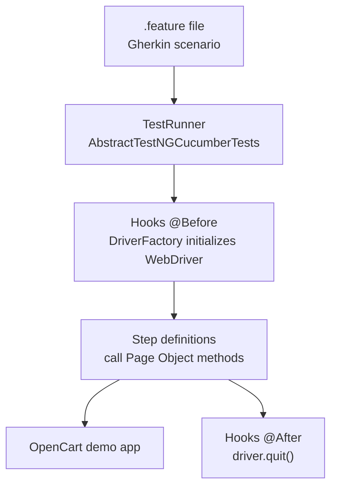
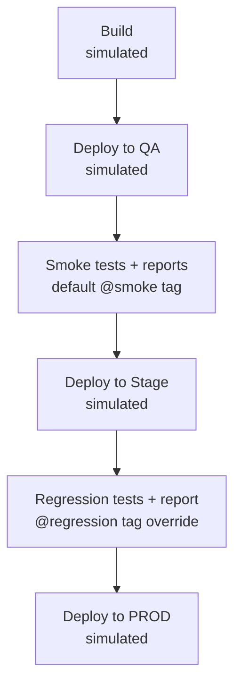

<div align="center">

# CUCUMBER_BDD_FW
### BDD Test Automation Framework — Cucumber + Selenium + TestNG


A Gherkin/Cucumber-driven Selenium framework testing the same [OpenCart demo application](https://naveenautomationlabs.com/opencart/) as the companion [POM_SE_TESTNG_FW](https://github.com/Manish12588/2026POMSeries) project — same Page Object classes and utilities, different test-authoring style: readable `Given/When/Then` scenarios instead of plain TestNG methods.

</div>

---

## Why this exists

This project exists to demonstrate BDD-style test authoring specifically — writing scenarios in Gherkin that a non-technical stakeholder could read, backed by step definitions that call into the same kind of Page Object layer used in a traditional TestNG framework. It was built independently (not sharing code via a module reference) as a deliberate learning exercise: writing the Cucumber wiring — runner, hooks, step definitions, tag-based suite filtering — from scratch rather than importing an existing working setup.

## Contents
- [Architecture](#architecture)
- [Running the tests](#running-the-tests)
- [Project structure](#project-structure)
- [Tech stack](#tech-stack)

---

## Architecture

### Design pattern
**BDD (Behavior-Driven Development)** via Cucumber-JVM, layered on top of the same **Page Object Model** approach as the TestNG version. Test scenarios are written in Gherkin (`.feature` files) in plain English; step definition classes translate each step into calls against page object classes, which hold the actual Selenium logic.

### Core components

| Component | Location | Responsibility |
|---|---|---|
| `.feature` files | `src/test/resources/features/` | Gherkin scenarios — Login, Accounts, Register, tagged by suite (`@smoke`, `@regression`) |
| Step definition classes | `src/test/java/steps/` | Translate Gherkin steps into page object calls and assertions |
| `Hooks` | `src/test/java/steps/` | Cucumber `@Before`/`@After` — driver setup/teardown per scenario, replacing what `BaseTest` does in the TestNG version |
| `TestRunner` | `src/test/java/steps/` | `AbstractTestNGCucumberTests` subclass — bridges Cucumber execution into TestNG, enabling parallel scenario execution and cross-browser parameters |
| `BrowserContext` | `src/test/java/utils/` | Thread-safe (`ThreadLocal`) carrier passing the `browser` TestNG parameter into `Hooks`, since Cucumber hooks don't receive TestNG `@Parameters` directly |
| `ScenarioContext` | `src/test/java/utils/` | Simple key/value store for passing data between step definitions within a single scenario (e.g. captured page title, carried from a `When` step to a `Then` step) |
| `DriverFactory`, `OptionsManager` | `src/main/java/com/qa/opencart/factory/` | Same driver-initialization logic as the TestNG framework |
| Page classes | `src/main/java/com/qa/opencart/pages/` | Same role as in the TestNG version — one class per application page |
| Utils (`ElementUtil`, `ExcelUtil`, `CSVUtil`, etc.) | `src/main/java/com/qa/opencart/utils/` | Same supporting utilities as the TestNG version |

### How a scenario runs


### Suite filtering — smoke vs. regression via tags
Unlike the TestNG framework's separate `testng_sanity.xml` / `testng_regression.xml` suite files, this project uses **Cucumber tags** to control scope. Every scenario is tagged (`@login`, `@smoke`, `@regression`, etc.), and `TestRunner`'s `@CucumberOptions` sets a default filter:

```java
@CucumberOptions(
    features = "src/test/resources/features",
    glue = "steps",
    tags = "@smoke",
    ...
)
```

This default can be overridden at runtime without touching code:
```bash
mvn test -Dcucumber.filter.tags="@regression"
```

### Cross-browser & parallel execution
`src/test/resources/testng.xml` runs `TestRunner` once per browser (`chrome`, `edge` — `firefox` present but currently commented out), with `parallel="tests"` and `thread-count="3"`. `BrowserContext` (a `ThreadLocal`) carries each test's `browser` parameter across into `Hooks`, since Cucumber's `@Before` hooks don't receive TestNG `@Parameters` directly — this is the bridge that makes cross-browser parallel execution work with Cucumber's execution model.

### Selenium Grid
Same pattern as the TestNG project: `docker-compose.yml` spins up a Selenium Grid (hub + Chrome/Edge/Firefox nodes, `4.47.0`) for containerized execution instead of local browser binaries.

### Reporting
- **Allure** — via the `allure-cucumber7-jvm` adapter, wired as a Cucumber plugin in `TestRunner`.
- **ChainTest** — via `chaintest-cucumber-jvm`, also wired as a Cucumber plugin.

### CI/CD — Jenkins

Same simulated-placeholder pattern as the TestNG project's pipeline (see that repo's README for the full reasoning) — Build/Deploy stages are `echo`-only, since this project targets a public demo application with nothing of ours to build or deploy. The real stages run the smoke suite (default tag), then the regression suite via a `-Dcucumber.filter.tags` override, publishing Allure and ChainTest reports after each.

---

## Running the tests

### 🖥️ Locally, from an IDE
Run `TestRunner` directly, or right-click a `.feature` file → Run (requires the Cucumber for Java IntelliJ plugin, and the Glue path configured — see `TestRunner`'s `@CucumberOptions`).

### ⚙️ Locally, via Maven (smoke suite — default)
```bash
mvn clean test -Dsurefire.suiteXmlFiles=src/test/resources/testng.xml -Denv=qa
```

### ⚙️ Locally, via Maven (regression suite)
```bash
mvn clean test -Dsurefire.suiteXmlFiles=src/test/resources/testng.xml -Dcucumber.filter.tags="@regression" -Denv=stage
```

### 🐳 Against Selenium Grid
1. Start the Grid:
   ```bash
   docker compose up -d
   ```
2. Set `remote=true` in the relevant config file under `src/test/resources/config/`.
3. Run as above — same feature files, same step definitions, only the driver initialization path differs.

### 🔁 Via Jenkins
Runs the smoke suite, then the regression suite (via tag override), publishing Allure and ChainTest reports for each.

---

## Project structure
```
src/
├── main/java/com/qa/opencart/
│   ├── constants/     # AppConstants
│   ├── errors/        # AppError
│   ├── exceptions/    # BrowserException, ElementException, FrameworkException
│   ├── factory/        # DriverFactory, OptionsManager
│   ├── pages/           # Page Object classes
│   └── utils/           # ElementUtil, ExcelUtil, CSVUtil, JavaScriptUtil, StringUtils, TimeUtil
└── test/
    ├── java/
    │   ├── steps/        # Step definitions, Hooks, TestRunner
    │   └── utils/         # BrowserContext, ScenarioContext
    └── resources/
        ├── features/      # .feature files (Login, Accounts, Register)
        ├── config/         # Environment properties
        └── testng.xml      # Cross-browser parallel runner config
```

---

## Tech stack
Java 11 · Selenium 4.47.0 · Cucumber-JVM 7 · TestNG (as Cucumber runner) · Maven · Allure (Cucumber adapter) · ChainTest (Cucumber adapter) · Apache POI (Excel) · OpenCSV · Docker (Selenium Grid) · Jenkins · Nexus 3